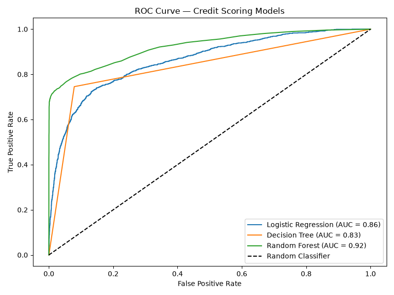
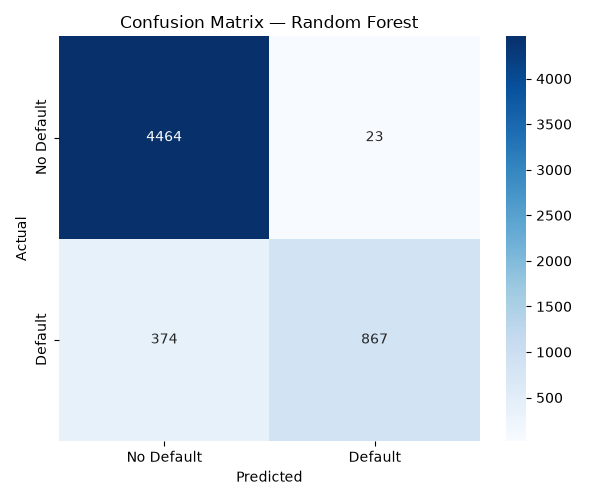
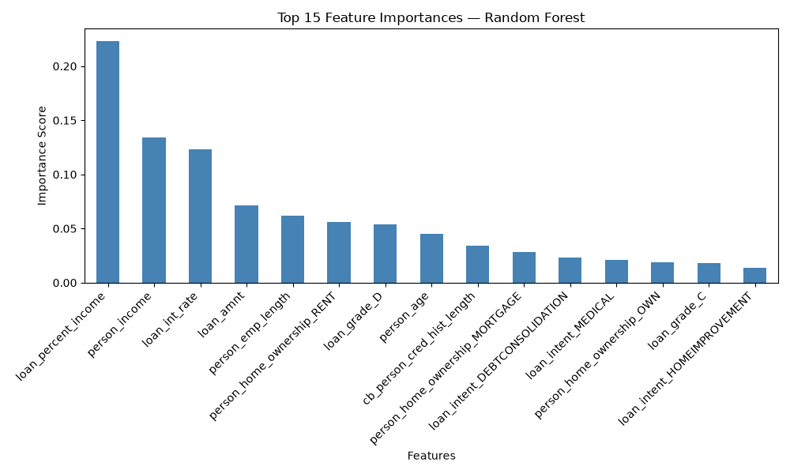
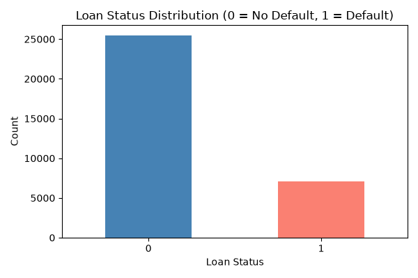

# 💳 Credit Scoring Model — CodeAlpha Internship Task 1

This project is part of my **Machine Learning Internship at CodeAlpha**.  
The goal is to predict an individual's **creditworthiness** using past financial data.

---

## 🎯 Objective

Build a machine learning model that predicts whether a person will **default on a loan** or not, based on financial features like income, loan amount, interest rate, and payment history.

---

## 📁 Project Structure

```
credit_score/
├── index.py                      # Main Python script
├── credit_risk_dataset.csv       # Dataset used
├── credit_scoring_model.pkl      # Saved best model
├── scaler.pkl                    # Saved scaler
├── roc_curve.png                 # ROC Curve graph
├── confusion_matrix.png          # Confusion Matrix graph
├── feature_importance.png        # Feature Importance graph
├── loan_status_distribution.png  # Target distribution graph
└── README.md                     # Project documentation
```

---

## 📊 Dataset

- **Source:** [Credit Risk Dataset — Kaggle](https://www.kaggle.com/datasets/laotse/credit-risk-dataset)
- **Rows:** 32,581
- **Target Column:** `loan_status` (0 = No Default, 1 = Default)

### Key Features:
| Feature | Description |
|---|---|
| `person_age` | Age of the person |
| `person_income` | Annual income |
| `person_emp_length` | Employment length (years) |
| `loan_amnt` | Loan amount requested |
| `loan_int_rate` | Loan interest rate |
| `loan_percent_income` | Loan as % of income |
| `cb_person_cred_hist_length` | Credit history length |
| `loan_grade` | Loan grade (A-G) |
| `loan_intent` | Purpose of loan |

---

## 🤖 Models Used

| Model | Type |
|---|---|
| Logistic Regression | Linear Classifier |
| Decision Tree | Tree-based Classifier |
| Random Forest | Ensemble Classifier |

---

## 📈 Evaluation Metrics

- ✅ Precision
- ✅ Recall
- ✅ F1-Score
- ✅ ROC-AUC Score
- ✅ Confusion Matrix

---

## 🚀 How to Run

### 1. Clone the Repository
```bash
git clone https://github.com/YOUR_USERNAME/CodeAlpha_CreditScoring.git
cd CodeAlpha_CreditScoring
```

### 2. Install Dependencies
```bash
pip install pandas numpy scikit-learn matplotlib seaborn joblib
```

### 3. Run the Script
```bash
python index.py
```

---

## 📊 Results

| Model | ROC-AUC Score |
|---|---|
| Logistic Regression | ~0.85 |
| Decision Tree | ~0.86 |
| **Random Forest** | **~0.93** ✅ Best |

---

## 🖼️ Output Graphs

### ROC Curve


### Confusion Matrix


### Feature Importance


### Loan Status Distribution


---

## 🛠️ Technologies Used

- **Python 3.x**
- **Pandas** — Data manipulation
- **NumPy** — Numerical operations
- **Scikit-learn** — Machine learning models
- **Matplotlib & Seaborn** — Data visualization
- **Joblib** — Model saving

---

## 👨‍💻 Author

**Your Name**  
Machine Learning Intern @ CodeAlpha  
🔗 [LinkedIn](https://www.linkedin.com/in/yhttps:/ajinkya-doke)  
🐙 [GitHub](https://github.com/ajinkyadoke-6byte)
---

## 📜 License

This project is for educational purposes as part of the CodeAlpha Internship Program.
